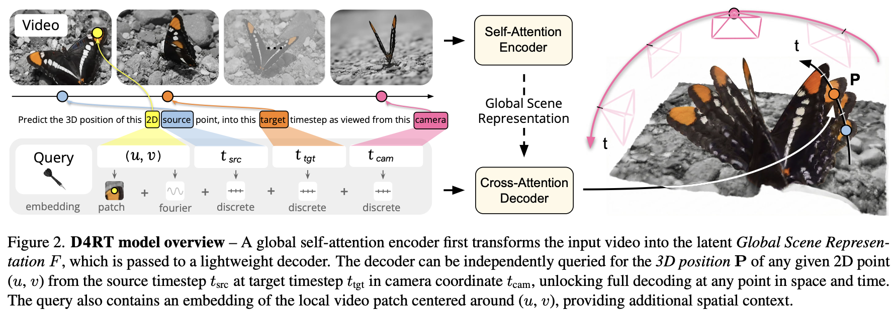

</img>

## d4rt

Implementation of [D4RT](https://d4rt-paper.github.io/), Efficiently Reconstructing Dynamic Scenes, by Chuhan Zhang et al. from Deepmind

## install

```shell
$ pip install d4rt
```

## usage

```python
from torch import randn, randint
from d4rt import D4RT

model = D4RT(
    dim = 512,
    video_image_size = 128,
    video_patch_size = 32,
    video_max_time_len = 10,
    enc_depth = 6,
    dec_depth = 6
)

videos = randn(2, 10, 3, 128, 128)

video_lens = randint(2, 10, (2,)) # handle variable lengthed video, can be None for max length always

# inputs

coors = randint(0, 128, (2, 5, 2))
time_src = randint(0, 10, (2, 5))
time_tgt = randint(0, 10, (2, 5))
time_camera = randint(0, 10, (2, 5))

query_lens = randint(1, 5, (2,)) # handle variable lengthed queries

# output

points = randn(2, 5, 3)

loss = model(
    videos,
    video_lens = video_lens,
    coors = coors,
    time_src = time_src,
    time_tgt = time_tgt,
    time_camera = time_camera,
    query_lens = query_lens,
    points = points,
)

loss.backward()

# without giving the output, it returns the prediction

pred = model(
    videos,
    coors = coors,
    time_src = time_src,
    time_tgt = time_tgt,
    time_camera = time_camera
)

assert pred.shape == (2, 5, 3)
```

## contribute

Just add your code and your tests in the `tests/` folder and run `pytest` in the project root

Vibing with attention models are welcomed

## citations

```bibtex
@article{zhang2025d4rt,
    title   = {Efficiently Reconstructing Dynamic Scenes One D4RT at a Time},
    author  = {Zhang, Chuhan and Le Moing, Guillaume and Koppula, Skanda and Rocco, Ignacio and Momeni, Liliane and Xie, Junyu and Sun, Shuyang and Sukthankar, Rahul and Barral, Jo{\"e}lle K. and Hadsell, Raia and Ghahramani, Zoubin and Zisserman, Andrew and Zhang, Junlin and Sajjadi, Mehdi S. M.},
    journal = {arXiv preprint},
    year    = {2025}
}
```

```bibtex
@inproceedings{liu2026geometryaware,
    title   = {Geometry-aware 4D Video Generation for Robot Manipulation},
    author  = {Zeyi Liu and Shuang Li and Eric Cousineau and Siyuan Feng and Benjamin Burchfiel and Shuran Song},
    booktitle = {The Fourteenth International Conference on Learning Representations},
    year    = {2026},
    url     = {https://openreview.net/forum?id=18gC6pZVVc}
}
```

```bibtex
@misc{joseph2026interpretingphysicsvideoworld,
    title   = {Interpreting Physics in Video World Models},
    author  = {Sonia Joseph and Quentin Garrido and Randall Balestriero and Matthew Kowal and Thomas Fel and Shahab Bakhtiari and Blake Richards and Mike Rabbat},
    year    = {2026},
    eprint  = {2602.07050},
    archivePrefix = {arXiv},
    primaryClass = {cs.CV},
    url={https://arxiv.org/abs/2602.07050},
}
```

```bibtex
@misc{li2025basicsletdenoisinggenerative,
    title   = {Back to Basics: Let Denoising Generative Models Denoise},
    author  = {Tianhong Li and Kaiming He},
    year    = {2025},
    eprint  = {2511.13720},
    archivePrefix = {arXiv},
    primaryClass = {cs.CV},
    url     = {https://arxiv.org/abs/2511.13720},
}
```

```bibtex
@misc{li2025basicsletdenoisinggenerative,
    title   = {Back to Basics: Let Denoising Generative Models Denoise},
    author  = {Tianhong Li and Kaiming He},
    year    = {2025},
    eprint  = {2511.13720},
    archivePrefix = {arXiv},
    primaryClass = {cs.CV},
    url     = {https://arxiv.org/abs/2511.13720},
}
```

```bibtex
@misc{charpentier2024gptbertboth,
    title   = {GPT or BERT: why not both?},
    author  = {Lucas Georges Gabriel Charpentier and David Samuel},
    year    = {2024},
    eprint  = {2410.24159},
    archivePrefix = {arXiv},
    primaryClass = {cs.CL},
    url     = {https://arxiv.org/abs/2410.24159},
}
```

```bibtex
@misc{balestriero2025lejepa,
    title   = {LeJEPA: Provable and Scalable Self-Supervised Learning Without the Heuristics},
    author  = {Randall Balestriero and Yann LeCun},
    year    = {2025},
    eprint  = {2511.08544},
    archivePrefix = {arXiv},
    primaryClass = {cs.LG},
    url     = {https://arxiv.org/abs/2511.08544},
}
```
